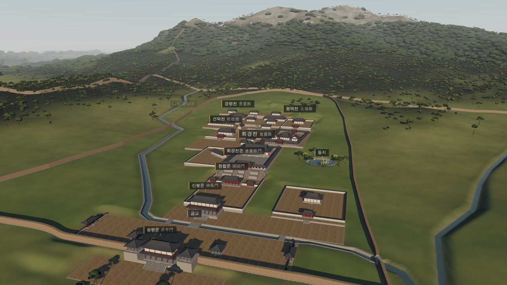
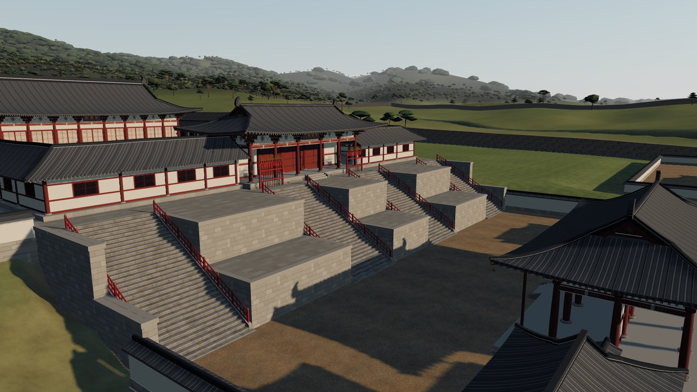
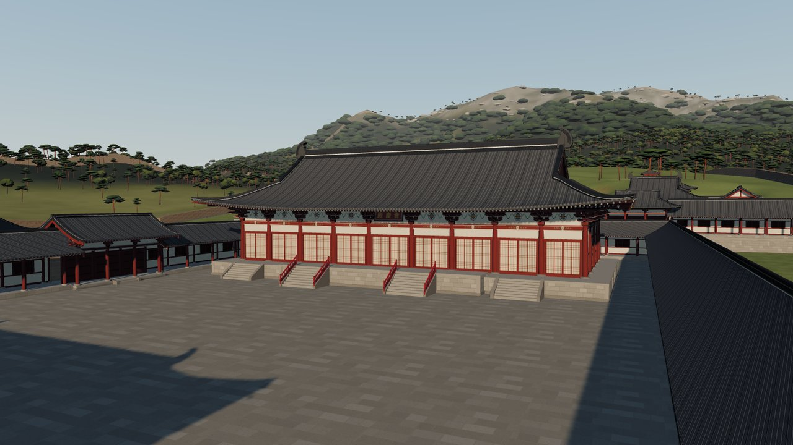
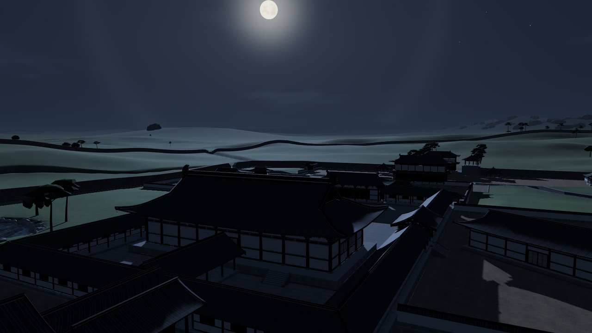
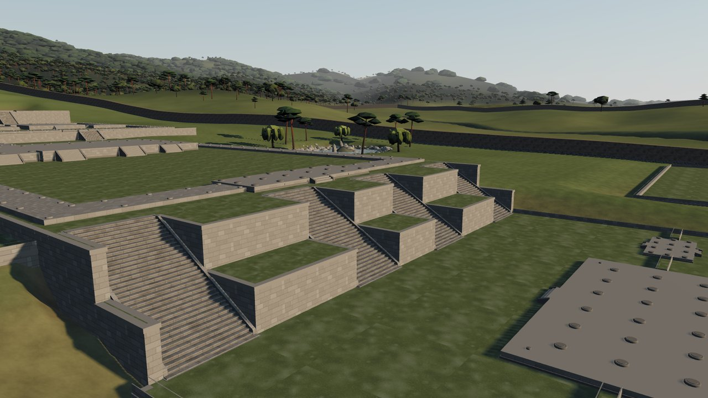

# 滿月臺 — 고려 개경 만월대 3D 복원

1123년, 송나라 사신 서긍(徐兢)이 개경에 한 달 남짓 머물며 『선화봉사고려도경』에 적어 남긴 고려의 정궁 **본궐(本闕)**을
웹 브라우저에서 둘러볼 수 있게 다시 세운 3D 복원입니다. 2007–2018년 남북 공동발굴 보고서, 『고려도경』·『고려사』의 기록,
현존 고려 목조건축의 비례를 함께 써서 송악산 남쪽 기슭의 축대 41곳, 전각과 문 45채, 회랑·담장·성벽, 물길과 숲을 만들었습니다.



| | |
|---|---|
|  |  |
|  |  |

## 실행하기

빌드 과정이 없는 ES 모듈 프로젝트입니다. three.js(0.170.0)는 `cdn.jsdelivr.net` 에서 불러오므로 인터넷 연결이 필요합니다.

```bash
node tools/serve.mjs          # → http://localhost:5173
```

ES 모듈은 `file://` 로 열리지 않으니 꼭 위처럼 http 서버로 여세요(Node 18 이상, 따로 설치할 것은 없습니다).

**한 파일 배포본**: `node tools/build.mjs` 를 돌리면 CSS·JS 를 모두 품은 `dist/index.html` 이 만들어집니다(`esbuild` 필요: `npm install`).
이 파일 하나만 아무 정적 서버에 올리면 됩니다. 예: `python3 -m http.server -d dist 8080` → <http://localhost:8080>.

권장 환경은 WebGL2 가 되는 최신 데스크톱 브라우저입니다. 휴대폰에서는 자동으로 ‘보통’ 화질(그림자 2048, 숲 밀도 55 %)로 시작합니다.

## 조작

| 동작 | 마우스·키보드 | 터치 |
|---|---|---|
| 돌려 보기 | 왼쪽 단추로 끌기 | 한 손가락으로 끌기 |
| 옮기기 | 오른쪽 단추 · Shift+끌기 | 두 손가락으로 끌기 |
| 가까이·멀리 | 휠 (커서 쪽으로 다가감) | 두 손가락 벌리기·오므리기 |
| 정보 보기 | 전각·이름표 누르기 | 누르기 |
| 걷기 | `G`, 걷는 중 `W A S D`·방향키, `Shift` 달리기, `Esc` 나가기 | 왼쪽 아래 조이스틱, 화면 끌어 둘러보기 |
| 시간대 | `1` `2` `3` `4` | 아래 도구 막대 |
| 안내 여행 | `T`, 이전·다음 `←` `→` | 도구 막대 ‘투어’ |
| 이름표 · 유적 · 평면도 · 정보 · 도움말 | `L` · `R` · `M` · `I` · `H` | 도구 막대 |

## 기능

- **안내 여행 12곳** — 하늘에서 본 궁궐, 승평문, 구정과 신봉문, 창합문, 33단 대계단, 회경전 뜰, 축대 위 전망, 장화전, 원덕전,
  건덕전과 서부 건축군, 경령전, 송악산 중턱. 해설은 모두 사료와 발굴 성과에 근거하며, 자동 재생도 됩니다.
  넓은 화면에서는 왼쪽 해설 패널만큼, 휴대폰에서는 아래 패널만큼 화면 중심을 옮겨 보는 대상이 가리지 않게 했습니다.
- **정보 카드** — 전각·문·다리·유적을 누르면 칸 수와 기둥 간 너비, 1138년에 바뀐 이름, 설명, 고증 메모와 함께
  **신뢰도(확실·추정·불확실)** 를 보여 줍니다. ‘가까이 가기’로 그 자리까지 날아갑니다.
- **이름표** — 1·2등급 전각, 유적, 주변 산 이름. 지형·건물·회랑·담장에 가리면 사라지고 겹치면 덜 중요한 것을 숨깁니다.
- **복원 / 유적 보기** — ‘유적’을 켜면 목조 건물을 모두 걷어 내고, 1361년 홍건적에 불탄 뒤 오늘까지 남은 축대·계단·초석만
  풀밭 위에 보여 줍니다.
- **시간대 4가지** — 팔관회 아침(음력 11월 보름 무렵, 남동쪽의 낮은 겨울 해), 한낮(하지), 해질녘(가을),
  **보름달 밤**(남동쪽 하늘에 뜬 만월과 달무리, 별). 해의 방위·고도는 개경의 위도와 궁궐 중심축의 방위(진북에서 서쪽으로 17°)로 계산합니다.
- **걷기** — 사람 눈높이(1.6 m)로 마당과 계단을 걸어 다닙니다. 기단·담장은 막히고, 높은 축대에서는 뛰어내리지 않습니다.
  하늘에서 걷기를 켜면 보던 곳에서 가장 가까운 마당에 내려섭니다.
- **평면도(미니맵)** — 궁성 평면 위에 지금 보는 곳과 해·달 방향을 표시하고, 누르면 그곳으로 날아갑니다.
- **다른 학설로 바꿔 보기** — ‘정보 › 복원에 대하여’에서 학설이 갈리는 네 가지를 바로 바꿔 볼 수 있습니다:
  회경전 뜰 바닥(박석 ↔ 전돌), 공포(주심포 ↔ 다포), 단청(12세기 적색 주조 ↔ 14세기 상록하단), 금원 정자 기와(회흑색 ↔ 청자기와).
- **역사와 고증** — 연표, 전각 목록, 참고 자료 65건, 복원 원칙과 가장 불확실한 부분.
- **화질** — 높음·보통·낮음(그림자 해상도, 숲 밀도, 해상도 배율). 프레임이 계속 느리면 해상도를 알아서 낮춥니다.
  장면은 무언가 바뀔 때만 다시 그리고, 그림자 맵도 빛이나 보는 곳이 바뀔 때만 갱신합니다.

## 고증의 바탕과 불확실성

자세한 근거는 **[docs/research.md](docs/research.md)** 에 정리했습니다. 요점만 추리면:

- **기준 시점 1123년.** 가장 자세한 동시대 기록(『고려도경』)이 이때의 것이고, 드러난 서부 건축군 유구도 12–13세기 전성기의 배치입니다.
  이름은 1138년 개칭 이전의 것(회경전·건덕전·신봉문·창합문)을 쓰고 뒤의 이름을 함께 적었습니다.
- **확실한 것** — 회경전 정면 9칸(39.16 m)×측면 4칸, 높이 7.4 m·33단 대계단 4개소, 회경전 일곽 회랑의 규모, 창합문·회경전문의 칸 수,
  궁성 둘레 약 2,170 m, 장화전 축이 약 5° 틀어진 사실, 서부 건축군 건물터 40여 동.
- **추정한 것** — 목조 상부 구조 전체(기둥 높이, 공포, 지붕 물매, 단청)는 현존 고려 불전(부석사 무량수전 등)과 송 『영조법식』에서 추정했습니다.
  단청은 조선식 모로단청이 아니라 12세기 적색 주조로 칠했습니다. 서부 건축군의 대지 높이는 보고서 수치와 SRTM 표고 경향으로 짰습니다.
- **가장 불확실한 것** — 발굴되지 않은 승평문·구정·동락정의 위치와 규모, 궁 안 광명천 물길과 금교, 서부 건축군 전각 이름의 비정,
  궁성·황성의 선형. 금원 정자·좌춘궁·동지·만령전 등은 기록에 근거한 **가상 배치**입니다.
- 모든 전각·다리·유적의 정보 카드에 신뢰도를 붙였고, 사료가 서로 어긋나는 쟁점(대계단 높이, 회경전문 칸수, 중정 포장, 공포 형식 등)은
  연구 노트 6.1절에 채택안과 함께 표로 남겼습니다.

## 프로젝트 구조

```
index.html              앱 껍데기(import map · 불러오기 화면 · UI 틀)
css/style.css           UI (먹색 패널 · 비색 강조 · 금박 선)
src/
  main.js               부트스트랩: 렌더러·카메라·조작, 세계 조립, UI 연결, 복원 선택지
  data/spec.js          장면 명세(대지·계단·전각·회랑·담장·다리·지형 격자·투어·연표·팔레트·모델링 규칙)
  core/materials.js     공유 재질 · core/textures.js 캔버스 텍스처와 결정적 난수 rng(seed)
  arch/building*.js     고려 목조건축 생성기(기단·배흘림기둥·공포·단청·창호·지붕·치미, LOD 3단계)
  arch/roof.js          팔작·우진각·사모·맞배 지붕 곡면과 용마루
  arch/elements*.js     돌계단·다리·회랑·궁성/담장/도성 성벽·유적 표지
  world/terrain*.js     지형(4겹 격자)·대지와 축대·물길·연못
  world/vegetation.js   소나무·참나무·버드나무 숲(인스턴싱)
  world/sky.js          하늘·해/달·별·안개·조명·그림자, 시간대 4가지
  ui/*.js               안내 여행·정보 카드·이름표·평면도·도구 막대·걷기/비행·피킹
dev/*.html              모듈별 확인 페이지(window.__views 카메라 프리셋)
docs/ARCHITECTURE.md    모듈 약속과 좌표계 · docs/research.md 고증 연구 노트
tools/serve.mjs         개발 서버 · tools/build.mjs 한 파일 배포본
tools/shoot.mjs         헤드리스 Chromium 스크린샷·콘솔 오류 검사(--mobile 로 휴대폰 흉내)
tools/spec/             장면 명세 생성기(Python)와 검사 도구
```

좌표는 회경전 중심축에 맞춘 PLAN 좌표계(미터, x=동, z=남, y=위, 원점=회경전 기단 중심)입니다. 자세한 약속은 [docs/ARCHITECTURE.md](docs/ARCHITECTURE.md).

**점검**: `node tools/shoot.mjs index.html --size 1280x800 --steps '[{"eval":"__app.tour.go(4, true)","wait":800,"shot":"t4.png"}]'`
처럼 테스트 API(`window.__app`: `tour.go`, `setTime`, `setRuins`, `setWalk`, `select`, `setAlt`, `lookAt`, `info()`)로 장면을 바꿔 가며 찍을 수 있고,
콘솔 오류가 하나라도 있으면 실패합니다.

## 성능

| 화질 | 그리기 호출 | 삼각형 |
|---|---|---|
| 높음 (데스크톱, 1280×800) | 약 90–290회 | 약 172만–197만 개 (그중 숲 약 116만) |
| 보통 (휴대폰 기본) | 약 190–270회 | 약 125만–136만 개 |
| 낮음 (그림자 없음) | 약 280회 | 약 100만 개 |

전각은 거리에 따라 세 단계(높음·보통·낮음)로 바뀌고, 계단·다리·담장·회랑은 재질별로 합쳐 그립니다. 나무는 인스턴싱합니다.
장면은 무언가 바뀔 때만 다시 그리므로, 가만히 보고 있을 때는 GPU 를 거의 쓰지 않습니다.

## 자료와 고마움

- **발굴 보고서**: 국립문화재연구원 『개성 고려궁성 남북공동 발굴조사보고서 Ⅲ·Ⅳ』(2020·2023), UNESCO 세계유산 등재신청서 1278rev.
- **1차 사료**: 『선화봉사고려도경』 권3–6·27, 『고려사』 세가·지리지, 『영조법식』 권5·13·14 (위키문헌), 국사편찬위원회 고려시대 사료 DB.
- **연구와 개설서**: 한국민족문화대백과사전, 우리역사넷(신편한국사), 남창근(2020) 「고려 본궐 만월대 주요전각 위치와 배치체계」,
  이은희(2016) 「고려시대 목조건축물의 上綠下丹 단청기법 수용」, Cha & Kim(2021) 고려 목조건축의 비례 체계, AURI 전통한옥 DB.
- **지리 자료**: SRTM 30 m DEM(OpenTopoData), OpenStreetMap(하천·랜드마크), Esri World Imagery(중심축 측정).
- **소프트웨어**: [three.js](https://threejs.org/) 0.170.0 (MIT), 글꼴 Song Myung · Gowun Dodum (Google Fonts, SIL OFL).

전체 목록과 링크는 [docs/research.md 8장](docs/research.md#8-참고-문헌)과 앱의 ‘정보 › 고증 자료’에 있습니다.
이 복원은 학술 자료를 바탕으로 한 해석이며, 새 발굴 성과가 나오면 달라질 수 있습니다.
